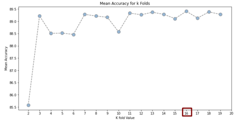
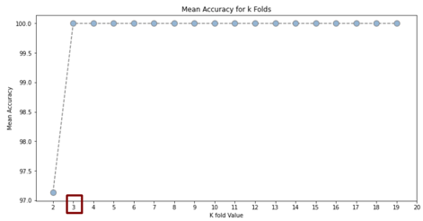
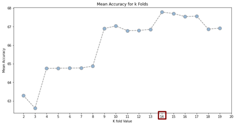
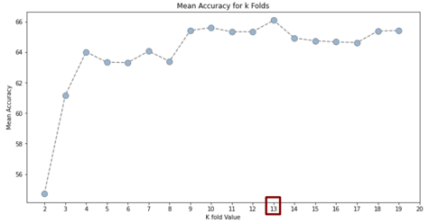
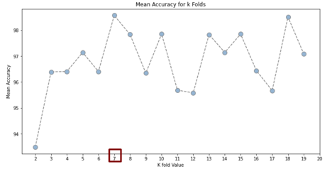
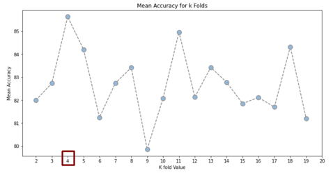
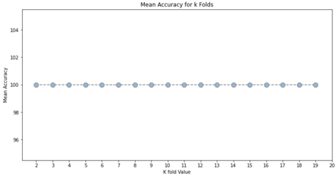

# **Hepatitis-Mortality-Analysis**

Predicting Hepatitis Mortality from the uci dataset (https://archive.ics.uci.edu/ml/datasets/hepatitis)

## **Description**

In this paper we process and analyze data concerning Hepatitis. The data was taken from the UCI and analyzed with the help of the Python language.In order to process them corectly,we use methods such as feature selection, oversampling and categorization models such as Naïve Bayes, Support Vector Machines, Logistic Regression and Decision Trees. To evaluate their performance we use cross validation and after comparing the results, we can see which method performs best for this particular dataset .
 
## **I.  Introduction**

After we have entered the data we begin the process of analysis and processing. After pre-processing our data and bringing it to the best possible form, we start modeling the classifiers for training and testing our models. More specifically, we try to compare the methods in order to find out the best method by applying the models to two different datasets. The original set with 19 features and the "processed" one with the best 12 features. At the same time for their evaluation, given our choice of feature selection we choose the method of cross validation.

## **II.  Metholodology**

To evaluate our models, we used cross validation, which is a reliable method of evaluating the classification as it divides the data into K parts using each time k-1 for training the model and k part for its validation. Classification report was selected as an output, as it gives us information on the performance of the model in 3 different metric (macro, micro, weighted ). For the evaluation and comparison of classification models, we focus mainly on accuracy and sensitivity. While for selecting the best value for k folds, we focus on Cross Validation Accuracy Score.

### **A.  Data**

In order to precess our data we need to bring it from a csv into a Dataframe format.We continue by replacing the "?" values with "0" and define the type of our datatset's features.

### **B. Classification Techniques**

- **Gaussian Naïve Bayes** (For reducing computional complexity, increasing speed and minimizing ranking error)
- **Support Vector Machines** (For clasifiaction and regression problems)
- **Logistic Regression** (with maximum likelihood estimation for minimizing the ranking error)
- **Decission Trees** (CA.R.T.)

### **C.  Description of the most Effective Method**
Initially the UCI dataset contains samples from 155 patients suffering from hepatitis and categorizes them into two classes: "Live" and "Die",by considering its 19 features.
By analyzing the distribution of our data, we notice an unequal distribution between the two classes with patients in the "Live" category touching 79 % .

 

This "disparity" between classes can lead to lower performance of categorization models specific to the minority class. Thus, we use the Oversampling method which randomly selects samples from the minority class and adds them to the original data set, resulting in 116 samples of patients class "Live" and 116 class "Die", achieving the perfect balance.
The 19 features are:

1.  AGE
2.  SEX
3.  STEROID
4.  ANTIVIRALS
5.  FATIGUE
6.  MALAISE
7.  ANOREXIA
8.  LIVER BIG
9.  LIVER FIRM
10.  SPLEEN PALPABLE
11.  SPIDERS
12.  ASCITES
13.  VARICES
14.  BILIRUBIN
15.  ALK PHOSPHATE
16.  SGOT
17.  ALBUMIN
18.  PROTIME
19.  HISTOLOGY

In order to  increase the accuracy and reduce the probability of error, we used the **feature selection** method. With Select K Best technique, we extract 12 features that contribute most to the categorization of patients as "Live" or " Die " and with The X^2 hypothesis test, and create a second dataset.
Given the small size of the given set, we choose the method of cross validation for our models evaluation, trying to find the best and most impartial classifier. So, we divide the whole dataset into k fields (depending on our model each time), train k - 1 fields and use the k filed to "validate" its performance. Thus, we compare their performance for both of our datasets. (The one with only oversampling, and the second with both oversampling and feature selection).

## **III.  Results**

Best 12 features (with Select K Best)Q

 

Once we are done with the above processing of the original dataset, we run the different sort models to see and evaluate the results:

### **Results of classification methods**
 
 **Gaussian Naïve Bayes**
 
 Dataset with 19 features 
 
   
   
Dataset with 12 features

   
   
in the initial case the maximum efficiency is noted for k=16, with the classification accuracy reaching 89.41 % while in the second case, where the 12 "best" characteristics are selected, from the fold size equals 3 and then, the accuracy is 100%.

 **Support Vector Machines**
 
 Dataset with 19 features 
 
   
   
Dataset with 12 features

   
   
Similarly, the model shows better performance for the first dataset for k = 14 with Mean Accuracy 67.77 %, while for the second dataset, for k=13 with Mean Accuracy 66.1% we share a 1-2% drop in models accuracy. This is caused due to the fact that SVM is an algorithm independent of the dimension of the features space, while it uses the normalization method to avoid overfitting. Thus, with the reduction of characteristics, the performance of the classification algorithm decreases. (75% for K=11 ==>  73% for K=15).

**Logistic Regression**
 
 Dataset with 19 features 
 
   
   
Dataset with 12 features

   

Same, there is increase in accuracy of 11 % with accuracy improving from 87.8% for K=5, to 98.57% for K=7.

**Decission Trees**
 
 Dataset with 19 features 
 
   
   
Dataset with 12 features

   

At first we had a maximum mean Accuracy for k = 4, with an efficiency of 85.63%, while in the second case we observe that whatever k fold value we use, its performance will have 100 % accuracy.
